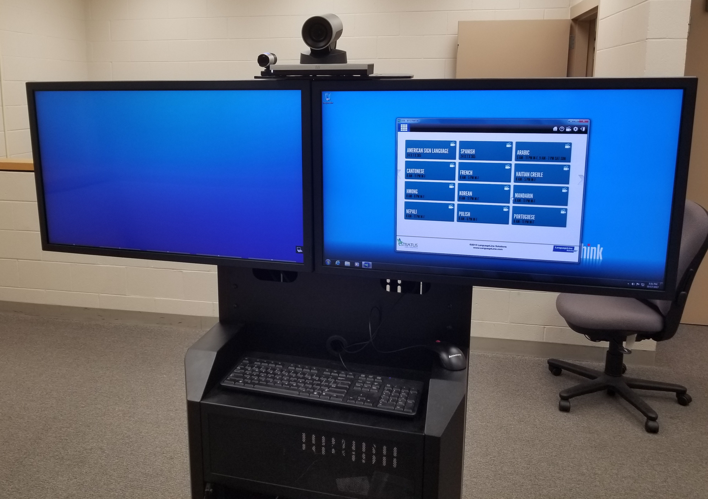
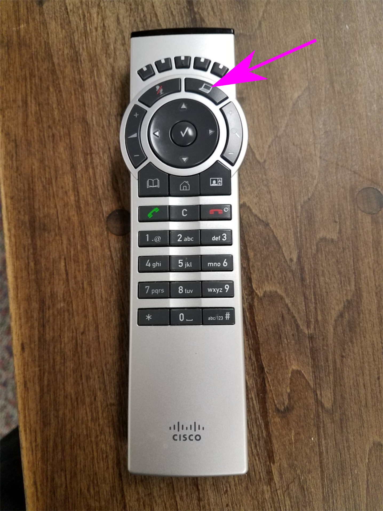
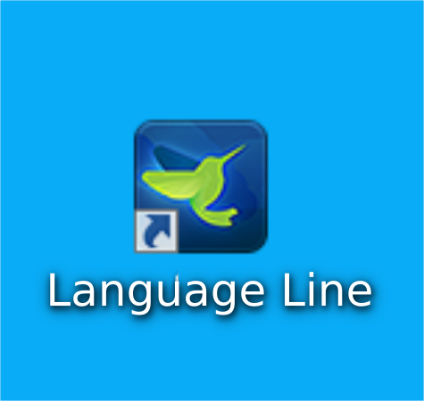
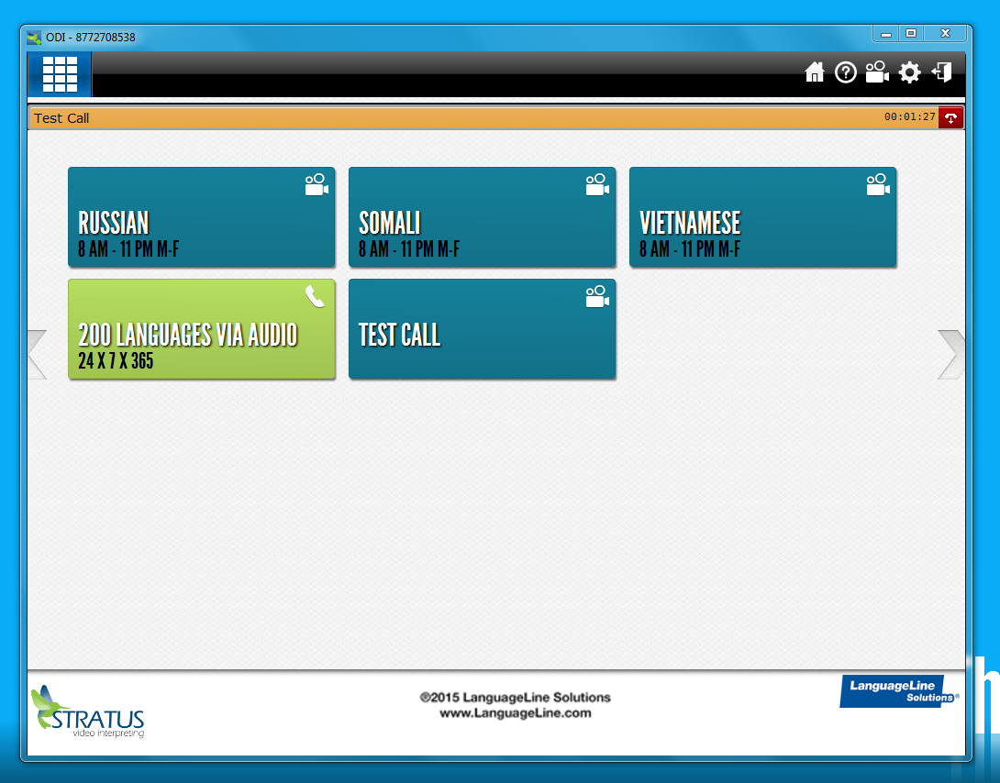
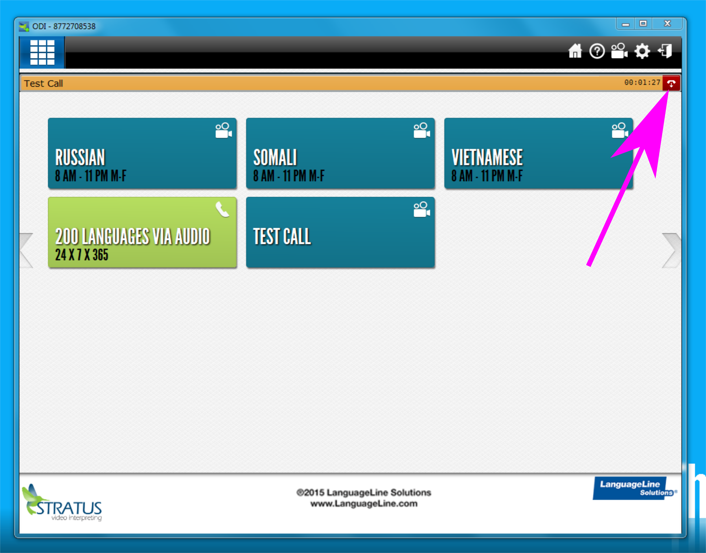

% Language Line PC Instructions
% David Pflug <dpflug@circuit5.org>
% November 11, 2017

# Language Line PC Equipment
\ 

# Step 1
Push the presentation button (shaped like a laptop) on the Cisco SX20 Remote  

# Step 2
Open Language Line  

# Step 3
Select a language  

# Ending a call
Push the End Call button  

